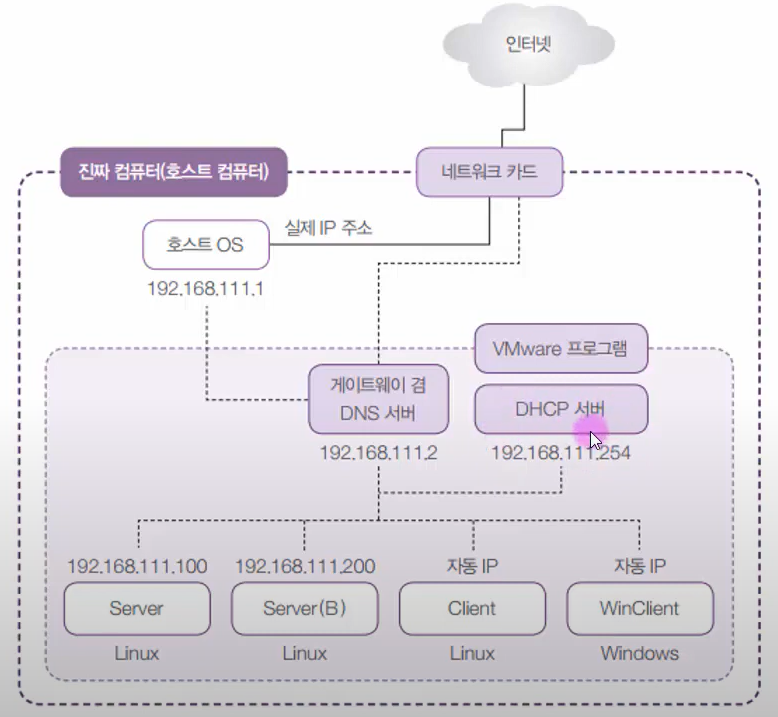
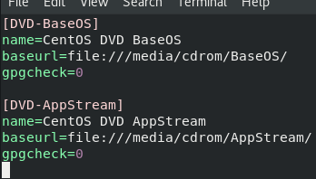
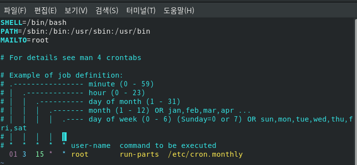
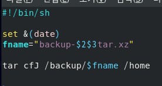
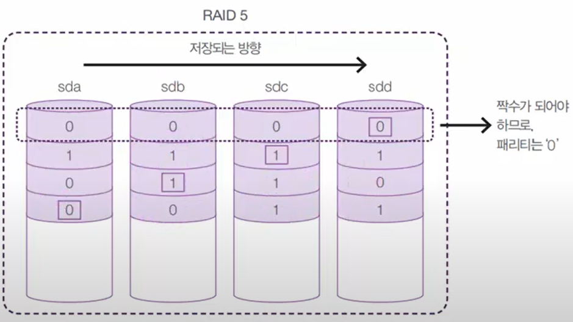

[toc]

# 1. 서버, 클라이언트

* DHCP서버: 각 가상머신에게 자동으로 IP를 부여하는 서버 컴퓨터

# 2. 서버 구축을 위한 개념 및 명령어

## 1) 시작, 종료

* 종료: shutdown -P now, halt -p, init 0
* 재부팅: shutdown -r now, reboot, init 6
* 로그아웃: logout, exit

## 2) 가상 콘솔

* 가상의 모니터. CentOS는 5 - 6개의 가상 콘솔 제공.
* 콘솔 이동은 ctrl + alt + f2 ~ f6
* shutdown -k +10: 10분뒤 서버가 종료될 것이라는 공지를 보냄(실제로 종료되지 않음)
* shutdown -h +10: 10분 뒤 서버를 종료시킴

## 3) 런 레벨(Runlevel)

* init 명령어 뒤에 붙는 숫자
* 컴퓨터의 현재 상태를 설정함
* init 0: power off(종료)
* init 1: Rescue(시스템 복구)
* init 2: Multi-User (사실 사용하지 않는 모드)
* init 3: Multi-User(텍스트 모드의 다중 사용자 모드)
* init 4: Multi-User (사실 사용하지 않는 모드)
* init 5: Graphical(그래픽 모드의 다중 사용자 모드)
* init 6: Reboot(재부팅)

* 모드 변경 명령어: ln -sf /lib/systemd/system/graphical.target default.target (graphical로 바꾸는 명령어)

* 멀티유저 모드에서 startx 명령어를 치면 그래픽 모드로 바뀜

# 3. CD/DVD 마운트, USB 연결

## 1) CD/DVD

* mount 명령어: 현재 연결된 장치들이 보임
* /dev/sda2는 슬래시('/') 파티션에 마운트 되어 있음
* umount /dev/cdrom: CD롬에서 마운트 해제 명령어

## 2) USB

* USB가 FAT32로 되어있어야함(NTFS면 리눅스에서 인식 X)
* 호스트 컴퓨터에서 USB가 인식되기때문에 가상머신에서 USB3.0으로 읽히게 설정하고 trust removable driver를 실행해야 읽힘

## 3) 텍스트 모드일때(Xwin 버전이 아닐때)

* 서버(B) 같은 경우엔 CD나 USB를 넣어도 자동으로 마운트가 되지 않아서 직접 해줘야함
* 우선 /media에 cdrom 폴더를 만들어주고
* mount /dev/cdrom /media/cdrom 명령어 입력(mount 명령어에 /dev/cdrom 장치를 /media/cdrom 디렉토리에 마운트 한다라는 의미)
* USD는 /dev/sdb1으로 설정(sda, sdb 순으로 장치 인식이 되며 1은 첫번째 파티션이라는 의미)

# 4. 사용자와 그룹

* 리눅스는 다중 사용자 시스템
* root는 수퍼유저. 모든 작업을 할 수 있는 권한이 있음

## 1) 사용자

*  /etc/passwd 파일에 있음
* 사용자 이름:암호:사용자 ID:사용자가 소속된 그룹ID:전체이름:홈디렉토리:기본 쉘
* 비밀번호는 x로 되지만 따로 관리가 됨
* 맨 아래에 새로 추가된 유저가 보임
* /etc/shadow에서 비밀번호를 관리하고 있음(암호화)

## 2) 그룹

* 그룹명:비밀번호:그룹 ID:그룹에속한 사용자명

## 3) 사용자와 그룹 관련 명령어

* useradd: useradd 사용자이름(다른것들은 자동으로 컴퓨터가 설정해줌. useradd newuser)

  유저는 /etc/skel 이라는 디렉토리의 내용을 복사해서 /etc/home디렉토리에 만들어짐. 만약 유저들이게 같은것을 배포하고 싶다면 skel에 내용을 업데이트 시켜놓으면 유저 생성시 자동으로 배포 됨

* passwd: 사용자의 비밀번호를 지정하거나 변경함(passwd newuser)

* usermod: 사용자의 속성을 변경(usermod -g root newuser)

* userdel: 사용자 삭제(userdel newuser)

  userdel -r newuser를 해야 home디렉토리까지 다 지워짐

* change: 사용자의 암호를 주기적으로 변경하도록 설정(change -m 2 newuser)

* groups: 현재 사용자가 속한 그룹을 보여주는 명령어

* groupadd: 새로운 그룹 생성(groupadd newgroup)

* groupmod: 그룹 변경(groupmod -n newgroup mygroup)

* groupdel: 그룹 삭제(groupdel newgroup)

* gpasswd: 그룹 암호 설정(많이 사용하지 않음. gpasswd newgroup)

### a. 사용자 추가 실습

* groupadd newgroup 추가.
* useradd -g newgroup newuser로 유저를 그룹에 추가시키며 유저 생성

# 5. 파일/디렉토리의 소유 및 허가권

* ls -l을 보면 파일의 내용은 아래와 같음

  파일 유형, 파일 허가권, 링크 수, 파일 소유자 이름, 파일 소유그룹 이름, 파일 크기, 마지막 변경 날짜/시간, 파일 이름 순

* 허가권은 3자리씩 끊어 읽음

* 첫 세자리: 소유자(User)의 파일 권한

* 두번째 세자리: 그룹(group)의 파일 권한

* 세번째 세자리: 그 외의 사용자(other)의 파일 권한

## 1) 관련 명령어

* chmod: 팡리 허가권 변경 (이진법으로 가능하지만 다른 방법도 있음. chmod u+x test.file -> 유저에게 실행 권한을 줘라)

* chown: 파일 소유권 변경(chown centos.centos sample.txt: centos 유저.centos그룹을 의미)

  <u>chown 명령어는 root 사용자만 가능</u>

# 6. 링크

## 1) 하드링크

* 원본 파일의 속성을 그대로 가지고 있어서 원본파일이 없어져도 그대로 상태 유지(inode 번호가 부여됨. inode는 포인터 개념)
* ls -il로 inode 번호 확인 가능

## 2) 심볼릭 링크

* 윈도우의 바로가기 개념이라서 원본파일이 없어지면 심볼릭 링크도 의미를 잃게 됨
* ln -s basefile softlinkfile

# 7. 프로그램 설치를 위한 RPM

* Redhat Package Manager를 사용하는 방법
* 사실 거의 사용을 안함(대신에 dnf를 사용)
* 윈도우의 setup.exe와 비슷한 설치 파일
* 확정명은 *.rpm이며, 패키지라고 부름
* 패키지이름-버전-릴리즈번호.CentOS버전.아키텍처.rpm
* x86_64: 64비트 CPU
* i386~686: 32비트용
* src: 소스
* noarch: 모든 CPU에 설치되는 소프트웨어

## 1) 명령어

* 설치: rpm -Uvh 패키치파일이름.rpm (U: 업그레이드, v: 설치과정 확인, h: 진행과정을 #표시로 화면 출력)
* 삭제: rpm -e 패키지이름(삭제는 패키지 이름만 넣으면 됨)
* 질의: rpm -qa 패키지 이름: ->설치됐는지 확인
* rpm -qip 패키지이름: 패키지 설치 전 패키지 내용 확인
* rpm -qi 패키지이름: 설치 후 패키지 내용 확인

## 2) RPM 단점

* 의존성 문제. A패키지를 설치하기 위해 B를 추가로 설치해야하는 경우가 있음
* 이를 해결하기 위해 DNF가 등장

# 8. 패키지 설치 DNF

* Dandified dnf
* CenOS 7은 YUM, 8부터는 DNF 명령을 사용
* rpm의 의존성 문제를 해결
* 필요한 파일이 있다면 인터넷에서 자동으로 다운받아서 설치

## 1) 사용법

* dnf -y install 패키지이름(-y 옵션은 파일 설치 모두 yes로 간주)
* RPM파일 설치: dnf install rpm파일.rpm
* dnf remove 패키지 이름
* 저장소 URL: /etc/yum.repos.d/ 디렉토리
* dnf info  패키지이름: 패키지 설명 정보 확인

## 2) 고급 사용법

* 패키지 그룹 설치: dnf groupinstall ""패키지그룹이름""
* 패키지 리스트 확인: dnf list 패키지이름
* GPG키 검사 생략
* dnf install --nogpgcheck rpm파일.rpm(CenOS 8에서 인증되지 않은 패키지를 강제로 설치)
* 기존 저장소 목록 지우기: dnf clean all

## 3) 경로 설정

* /etc/yum.repos.d/ 디렉토리에서 *.repo 파일 만들고 다운로드 받을 경로를 설정
* 아래 예시는 다운로드를 DVD에서 받아오는 것으로 설정함

# 9. 파일 압축, 묶기

## 1) 압축

* xz, bz2, gz, zip 등
* xz나 bz2가 압축률이 좋음
* xz -d 파일명.xz: xz 압축 풀기 명령어
* bzip2 -d 파일명.bz2: bzip2 압축 풀기 명령어
* gzip -d 파일명.gz: gzip 압축 풀기 명령어

## 2) 묶기

* tar -cvf my.tar /etc/sysconfig: 묶기
* tar -xvf my.tar: 풀기

## 3) 압축과 묶기를 동시에

* tar cvfJ my.tar.xz 묶을파일 (J는 xz임. z는 gzip)

# 10. 파일 위치 검색

* find /etc -name ""*.conf"
* find /bin -size +10k -size -100k
* find /home -name ""*.swap" -exec rm {} \; (이름이 swap확장자인 파일을 home에서 찾아서 지우라는 명령)

# 11. 시스템 설정

## 1) 표준 시간대 변경

## 2) 네트워크 설정(nmtui)

## 3) 방화벽 설정(firewall-config)

## 4) 서비스 설정(ntsysv)

* 서비스는 백그라운드에서 자동으로 돌아가는 프로그램들을 통칭.
* 자동으로 꺼질지 켜질지 설정.
* 패키지가 없다면 dnf install ntsysv

# 12. CRON과 AT

## 1) cron

* 주기적으로 반복되는 일을 자동적으로 실행할 수 있도록 설정
* 관련파일은 /etc/crontab
* 시간별, 일별, 주별, 월별에 script를 넣어놓으면 자동으로 실행됨
* 01 **** root run-parts /etc/cron.hourly (01분 모든 시/일/월/요일마다)
* 02 4*** root run-parts /etc/cron.daily (02분 새벽4시 모든 일/월/요일마다)

## 2) at

* cron과 다르게 at는 1회성

## 3)  cron 실행

* openrdate 설치 후 systemctl status crond로 실행중인지 확인
* 실행이 안되고 있으면 systemctl start로 실행
* vim /etc/crontab으로 설정 가능

* /etc/cron.monthly에 .sh파일을 만들어 명령어 입력

* rdate -s time.bora.net: 표준 시간으로 되돌릴 때 사용

## 4) at 실행

* at 4:00am tomorrow와 같이 설정
* 후에 명령어 실행(dnf -y update 후 reboot)
* ctrl+d를 눌러서 저장
* at -l: 저장되어있는 at 확인
* atrm 번호: 실행 예정 at를 지움

# 13. 네트워크 관련 개념

## 1) TCP/IP

* 컴퓨터끼리 네트워크 상으로 의사소통을 하는 "프로토콜(대화)"

## 2) 호스트 이름과 도메인 이름

* 호스트 이름: 각각의 컴퓨터 이름
* 도메인: lgchem.com과 같은 개념

## 3) IP 주소

* 각 컴퓨터의 랜카드에 부여되어있는 주소
* 중복되지 않음

## 4) 네트워크 주소

* IP주소가 같은 네트워크에 속해있는 공통된 주소(앞 3자리까지)

## 5) 브로드캐스트(broadcast) 주소

* 내부 네트워크의 모든 컴퓨터가 듣게 되는 주소
* 현재 주소의 맨 끝 자리가 255로 된 주소(C클래스)

## 6) 게이트웨이(gateway), 라우터(router)

* 라우터 = 게이트웨이
* 네트워크 간에 데이터를 전송하는 컴퓨터 혹은 장비

## 7) 넷마스크(netmask)&클래스(class)

* 255.255.255.0
* 네트워크의 규모를 결정

## 8) DNS(domain name system) 서버(=네임 서버) 주소

* URL을 해당 컴퓨터의 IP주소로 변환해주는 서버(예: naver.com을 IP주소로 변환)
* 설정 파일은 /etc/resolv.conf
* DHCP서버: 자동으로 IP를 부여해주는 서버

## 9) 리눅스에서 네트워크 장치 이름

* 랜카드는 ens160 혹은 ens32로 인식함
* 이전에선 eth0, eth1로 인식했음

# 13. 네트워크 명령어 및 파일

## 1) nmtui

* 네트워크 관련된 대부분의 작업을 이 명령어로 수행
* 자동 ip 주소 또는 고정 ip주소 사용 결졍
* ip주소, 서브넷 마스크, 게이트웨이 정보 입력
* DNS 정보 입력
* 네트워크 카드 드라이버 설정
* 네트워크 장치(ens32)의 설정

## 2) systemctl <start/stop/restart/status> NsetworkManager

* 네트워크의 설정을 변경한 후에 변경된 내용을 시스템에 정용시키는 명령어

## 3) ifup <장치이름> 및 ifdown <장치이름>

* systemctl보다 강력함

## 4) ifconfig <장치이름>

* 네트워크 장치의 정보 확인

## 5) nslookup (후에 "server" 입력)

* DNS 서버의 작동을 테스트하는 명령어

## 6) ping <IP주소 또는 URL>

* 네트워크에서 응답하는지 테스트하는 명령어

# 14. 네트워크 설정과 관련된 주요 파일

## 1) /etc/sysconfig/network

* 네트워크의 기본적인 정보가 설정되어 있는 파일

## 2) /etc/sysconfig/network-scripts/ifcfg-ens32

* ens32 장치에 설정된 네트워크 정보가 모두 들어 있는 파일

## 3) /etc/resolv.conf

* DNS서버 정보 및 호스트 이름이 들어있음

## 4) /etc/hosts

* 현 컴퓨터의 호스트 이름 및 FQDN이 들어있는 파일

# 15. 네트워크 보안을 위한 SELinux

* 강제(Enforcing), 허용(Permissive), 비활성(Disabled) 세가지 레벨
* 설정 파일인 /etc/sysconfig/selinux를 편집하거나 system-config-selinux명령으로 설정

# 16. 파이프, 필터, 리디렉션

## 1) 파이프(pipe)

* |: 두개의 프로그램을 연결해주는 통로

## 2) 필터(filter)

* 필요한 것만 걸러주는 명령어
* grep, tail, wc, sort, awk, sed 등

## 3) 리디렉션(redirection)

* 표준 입출력의 방향을 바꿔줌
* 예) ls -l > list.txt (>>: append함)

# 17. 프로세스, 데몬

* 프로세스: 하드디스크에 저장된 실행코드(프로그램)가 메모리에 로딩되어 활성화된 것
* 포그라운드 프로세스(Foreground Process): 눈에 보이는 프로그램
* 백그라운드 프로세스(Background Process): 백신, 서버 데몬 등
* 프로세스 번호: 실행될때마다 부여되는 고유 번호
* 작업번호: 백그라운드 프로세스의 순차번호
* 부모 프로세스와 자식 프로세스: 예) OS 내에 실행되는 powerpoint. 부모프로세스(OS)가 꺼지면 자식프로세스(powerpoint)도 꺼짐
* 프로세스 관련 명령어: ps(ps -ef로 확인), kill(강제종료), pstree(부모 자식 프로세스 확인)
* &: 명령어 뒤에 &을 붙이면 백그라운드에서 작업이 됨

# 18. 서비스와 소켓

## 1) 서비스

* 시스템과 독자적으로 구동되어 제공하는 프로세스. 웹서버(httpd), DB 서버(mysqld), FTP 서버(vsftpd) 등
* 실행 종료는 systemctl start/stop/restart 서비스이름
* 실행 스크립트 파일은 /usr/lib/systemd/system/디렉토리에 서비스이름.service 라는 이름으로 확인. cron 서비스는 crond.service라고 들어잇음

## 2) 소켓

* 요청이 오면 잠깐 띄웠다가 닫는 것.
* 탈넷 서버가 예
* /usr/lib/systemd/system/이렉토리에 소켓이름.socket으로 존재

# 19. 응급 복구

* 시스템이 부팅이 되지 않을 경우

## 1) root의 비밀번호 분실 시

* 부팅 시 e를 눌러 4번째줄 linux ($root) 줄 맨 뒤 rhgb quiet 삭제, 같은줄 맨 뒤에 init=/bin/sh를 써줌
* 그리고 ctrl+x를 누르면 부팅이 됨
* mount로 확인해보면 /dev/sda2가 ro인데, mount -o remount,rw /를 입력하면 rw(read write)로 변경됨
* 그리고 비밀번호 변경 가능

## 2) GRUB 부트로더

* 설정 방법: /etc/default/grub 파일과 /etc/grub.d/디렉토리 파일 수정 후 grub2-mkconfig 명령어를 실행함
* vim /etc/default/grub 으로 변경 후 grub2mkconfig -o /boot/grub2/grub.cfg로 설정
* 1)에서 설정된 비밀번호 변경을 아무나 못하게 설정(cd /etc/grub.d 디렉토리에서 vim 00_header에서 맨 밑에 4줄정도 써야함. 아래 절차대로)
* **cat << EOF**
* **set superuser="thisislinux"**
* **password thisislinux 4321**
* **EOF 후에 grub2mkconfig -o /boot/grub2/grub.cfg 명령 실행**

# 20. 모듈의 개념과 커널 컴파일의 필요성

* 커널: 하드웨어와 소통하는 역할(자동차의 엔진 역할)
* 모듈: 커널에서 평소 불필요한 것들을 모듈로 저장해놓음

## 1) 커널 컴파일

* 커널을 업그레이드(컴파일) 할 수 있음

## 2) 커널 업그레이드

* uname -r: 버전 확인.  (4.18.0과 같이 버전이 나옴)
* kernel.org에서 원하는 버전 다운
* /usr/src에서 커널 소스 압축 풀기
* 필수 패키지 설치: dnf -y install make bison flex elfutils-libelf-devel openssl-devel
* 커널 설정 초기화: make mrproper(/usr/src/리눅스에 들어가서 명령어 입력)
* 커널 컴파일 환경설정(커널과 모듈에 뭘 넣을지 설정해주는것): make xconfig 입력
* .config 파일을 vim으로 열어서 /CONFIG_SYSTEM_TRUSTED 두줄을 모두 삭제 혹은 주석처리로 바꾸기
* make clean으로 정리하기
* make ; make modules_install ; make install

# 21. X윈도 사용

## 1) 테마 변경

* su -c 'dnf -y install gnome-tweak-tool': -c 옵션으로 1번만 관리자 권한으로 명령을 실행할 수 있음
* 위 명령 실행 후 옵션 테마창을 보면 바꿀 수 있는 기능들이 생김

## 2) GRUB 배경 설정

* png 파일 다운로드
* su -c 'mv wallpaper.png /boot/grub2' 로 파일 옮기기
* su -c 'vim /etc/default/grub' 실행
* "console" 있는 줄을 주석처리
* 마지막줄에 GRUB_BACKGROUND='/boot/grub2/wallpaper.png'
* su -c 'grub2-mkconfig -o /boot/grub2/grub.cfg' 로 적용

## 3) 파일 브라우저 노틸러스

* 윈도우의 탐색기와 비슷

## 4) 브라세로

* CD/DVD ISO 파일 만드는 프로그램
* 새 데이터 디스크 프로젝트로 진행

## 5) 파이어폭스 업데이트

* 브라우저에서 파일 다운로드
* 관리자 권한으로 mv firefox /usr/local/ 옮기기
* chown -R root.root /usr/local/firefox/ 로 권한 바꾸기 (-R은 하부 파일과 폴더까지 다 바꾸기)
* cd /usr/local/bin/ 으로 이동
* ln -s /usr/local/firefox/firefox . 으로 링크 만들기

# 22. 하드디스크 관리

* VMware상 메인보드에 SCSI는 서버용 하드를 주로 설치함(0 ~ 15번까지 총 16개 슬롯이 있음). 1개는 이미 reserved라 15개 사용 가능
* 하드디스크를 /dev/sda(sda1, sda2..), sdb, sdc 형식으로 부름
* 반드시 하나 이상의 파티션이 있어야함

## 1) 파티션 나누기

* 하드디스크(SCSI) 추가 장착
* fdisk 명령어 사용: fdisk /dev/sdb
* n 입력(new partition)
* p 입력(primary 파티션)
* 1 입력(파티션 1개)
* 사이즈 설정에서 그냥 엔터(디폴트값)
* 두번째 사이즈 설정에서 그냥 앤터(디폴트값)
* w 입력(write, 저장)

## 2) 포멧

* mkfs.ext4 /dev/sdb1: 위 파티션 나눈 하드디스크를 사용할 수 있도록 포멧해줌.(ext4 타입이 많이 쓰임)
* mount /dev/sdb1 /mydata: 슬래시(/)에 mydata라는 디렉토리를 만들고 sdb1을 mydata로 연결시켜주는 mount 명령어
* mount 명령어를 치면 맨아래 내용을 확인할 수 있음

## 3) 부팅시  자동 mount

* vim /etc/fstab에서 맨 아래에 /dev/sdb1 /mydata ext4 defaults 0 0 추가

## 4) 여러개 디스크 관리하는 RAID

* RAID(Redundant Array of Inexpensive Disks)디스크 구조 여러개의 디스크를 마치 한개의 디스크인척 사용하는것
* 비용절감(10테라 디스크보다 1테라 디스크 10개가 더 쌈)
* 여러군데 나눠서 저장하기 때문에 성능, 신뢰성이 향상됨

### a. 하드웨어

* 안정적이지만 상당히 비쌈

### b. 소프트웨어

* 하드웨어 RAID의 대안.

### c. 각 RAID 방식의 비교

* 단순볼륨: 하나의 디스크

#### i. Linear RAID

* 2개 이상
* 차례대로 하나로 묶는 것. 저장은 첫번째 디스크부터 저장됨
* 100% 공간 효율성(=비용 저렴)
* 

#### ii. RAID 0

* 2개 이상
* 2개이상 디스크에 동시에 저장(stripping)
* 100% 공간 효율성
* 신뢰성 낮음
* 빠른 효율성이지만 안정적이지 않음
* 디스크 크기가 다르면 가장 작은 크기의 디스크만큼만 다같이 저장이 됨(1TB, 100TB, 100TB라면 모두 1TB만 사용됨)

#### iii. RAID 1

* 미러링(mirroring)이라고 부름. 백업개념
* 저장용량이 2배가 필요함. 첫번째 디스크에 저장되면 두번째도 같이 저장이 됨
* 비용이 많이 들고 공간효율이 안좋음.
* 저장속도가 느려지진 않음
* 결함 허용 제공(Fault-tolerance)하기 때문에 중요한 데이터 저장에 적절함

#### iv. RAID 5

* RAID 0 + RAID 1의 장점
* 3개 이상. 결함 허용 제공
* 페리티(데이터 복구를 위한 것) 정보 사용
* 짝수가 되어야 하는 값을 페리티에 넣어줌.

* 디스크 개수 - 1 의 공간을 사용하기때문에 효율이 좋은편
* 디스크 2개가 고장나면 복구 불가능

#### v. RAID 6

* 최소 4개 디스크 사용
* RAID 5의 개선
* 성능은 RAID 5에 비해 약간 떨어짐
* 
* 페리티를 2개 사용

#### vi. RAID 1 + 0

* RAID 1과 0의 장점을 동시에 가짐. 마찬가지로 RAID 1 + 5와 같은 다양한 방식으로 적용 가능

# 23. RAID 만들기

* VMware에서 하드디스크 추가
* fdisk /dev/sdb 후 파티션 나누기
* t 입력 후 fd 설정. 파티션 타입이 linux가 아니라 16진법인 fd(Linux raid auto)로 설정해야함
* mdadm 명령어를 사용하여 두개를 하나로 논리볼륨으로 묶음
* 두개 묶으면 sd 대신 md라는 이름이 부여됨
* mdadm --create /dev/md9 --level=linear --raid-devices=2 /dev/sdb1 /dev/sdc1 (mdadm 명령어로 /dev/md9라는 RAID를 만드는데 linear 형식이고 디바이스는 2개이다. 그 디바이스는 sdb1과 sdc1이다 라는 의미)
* mdadm --detail --scan: 현재 작동하는 디바이스 확인
* mdadm --detail /dev/md9: md9에 대한 자세한 내용 확인 가능
* mkfs.ext4 /dev/md9로 포멧
* mount /dev/md9 /raidLinear: md9를 /raidLinear라는 디렉토리에 마운트 시킴
* df 명령어로 디스크 스페이스 확인
* vim /etc/fstab에서 마지막에 /dev/md9 /raidLinear ext4 defaults 0 0으로 부팅시 자동 마운트 설정

# 24. 하드디스크 관리(문제발생 및 조치방법)

* mdamd --stop /dev/md9: md9로 설정해놨던 RAID를 정지시킴(linear나 RAID0은 하나만 제거 되어도 복구 불가능. 그래서 나머지도 지워서 정상 부팅/작동 되도록 해야함)
* vim /etc/fdtab에서도 해당 내용 삭제
* RAID1이나 RAID5는 정상 작동 되고 있으니 얼른 백업해놓아야함

## 1) 복구

* 새로운 하드디스크를 장착을 해서 원래대로 복구

### a. linear 혹은 RAID0

* linear나 RAID0은 데이터 복구 불가능 하며 장치만 원래대로 돌려놓는것
* 하드디스크를 장착했으면 fdisk로 다시 파티셔닝
* 복구 후 RAID0에 파일이 있는것 처럼 보여도 50% 데이터만 있는 깨진 파일임. linear에는 간혹 데이터가 살아있는 경우가 있음

### b. RAID1 혹은 RAID5

* mdadm /dev/md5 --add /dev/sdi1 : mdadm --add옵션으로 md5 RAID에 sdi1 이라는 디스크만 추가
* 마지막으로 vim /etc/fstab 에서 md5 내용 추가

# 25. 하드디스크 관리(LVM)

* Logical Volume Manage
* RAID와 비슷하지만 약간 다름
* 2TB 용량의 하드 2개를 합친 후 1TB와 3TB로 나눠서 사용 가능
* 물리볼륨: /dev/sda1, /dev/sdb1 등의 파티션
* 볼륨 그룹: 물리 볼륨을 합쳐서 1개의 물리 그룹으로 만드는 것
* 논리 볼륨: 볼륨 그룹을 1개 이상으로 나눠서 논리 그룹으로 나눈 것

## 1) LVM 만들기

* 하드디스크 장착(예: 2TB와 3TB)
* fdisk /dev/sdb와 sdc 실행
* 포맷 저장 전 t로 타입 8e(Linux LVM) 지정
* pvcreate /dev/sdb1, /dev/sdc1으로 피지컬 볼륨으로 만들기
* vgcreate /dev/myVG /dev/sdb1 /dev/sdc1 으로 볼륨 그룹 만들기
* vgdisplay로 볼륨 그룹 확인 가능
* lvcreate --size 1T --name myLG1 myVG 입력(lvcreate 명령어로 사이즈는 1TB이고 이름은 myLG1로 만듦)
* lvcreate --extents 100%FREE --name myLG2 myVG(마지막은 용량이 정확하지 않기때문에 나머지를 전부 사용하라는 extents 옵션 사용)
* mkfs.ext4 /dev/myVG/myLG1, myLG2, myLG3로 포멧
* mkdir /lvm1 /lmv2 /lmv3 로 디렉토리 생성
* mount /dev/mvVG/myLG1 /lvm1 등으로 마운트
* fstab에 등록

# 26. 사용자별 공간 할당 - 쿼터

* 사용자나 그룹이 생성할 수 있는 파일의 용량 및 개수를 제한하는 것

## 1) 쿼터 만들기전 설정

* 디스크 장착
* 파티션(기본 리눅스 파티션), 포멧, 마운트(/userHome으로), fstab 등록 진행
* useradd -d /userHome/john john: john이라는 사용자 생성
* useradd -d /userHome/bann bann: bann이라는 사용자 생성
* passwd john, bann 으로 비밀번호 설정

## 2) 쿼터 만들기

* fstab에서 /userHome defaults를  defaults,usrjquota=aquota.user,jqfmt=vfsv0 으로 수정
* mount --options remount /userHome으로 리마운트

## 3) 쿼터 DB 생성

* cd /userHome 이동
* quotaoff -avug 명령어로 쿼터 오프
* quotacheck -augmn 실행
* rm -rf aquota.* 삭제 실행
* touch aquota.user aquota.group 만들기
* chmod 600 aquota.* 명령어 실행. 다른사람들이 보지 못하도록 하기 위해
* 다시 quotacheck-augmn 실행
* quataon -avug로 쿼터 실행
* edquota -u john으로 vim 환경 실행
* soft(경고)와 hard(실제 제한되는 용량)의 용량 설정(kb로 설정)
* su - john 으로 변경 호 quota 명령어를 치면 하드 용량 권한을 볼 수 있음
* root 관리자는 repquota /userHome 을 보면 quota 사용 현황을 볼 수 있음
* edquota -p john bann: john 사용자의 quota 내용을 bann에게도 paste하여 설정을 같게 한번에 바꿀 수 있음

# 27 원격지 시스템 관리-텔넷

* 서버 컴퓨터에 접속해서 사용할 수 있게 하는것
* 오랫동안 사용되어옴. 보안에 취약함
* 클라이언트는 꼭 리눅스가 아니어도됨

## 1) 텔넷 서버 구축

